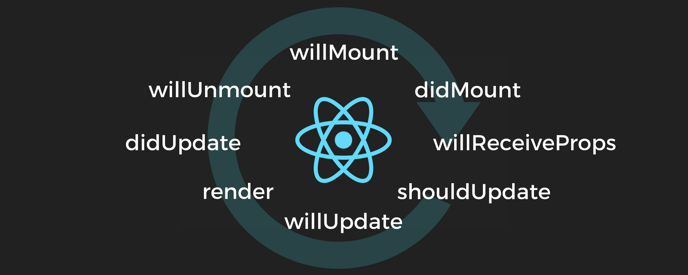
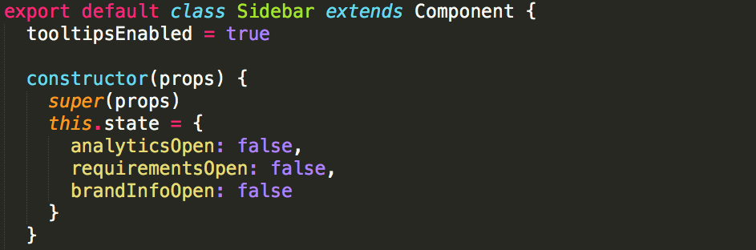
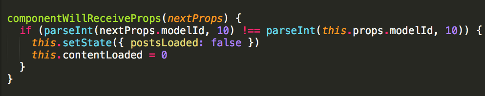
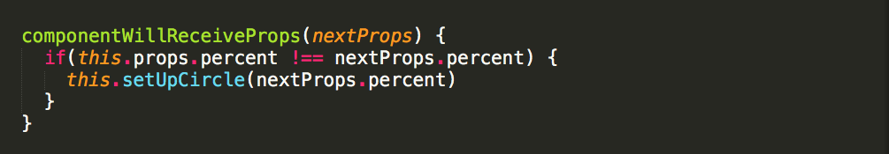
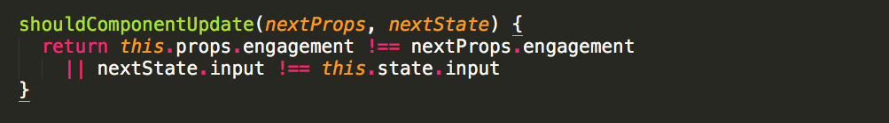
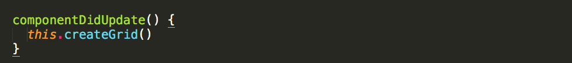
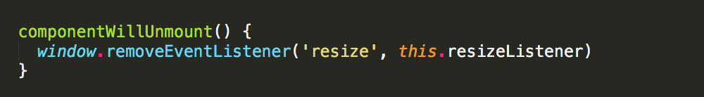

## 【译】React生命周期方法总结——使用方式和时机

>原文地址：https://engineering.musefind.com/react-lifecycle-methods-how-and-when-to-use-them-2111a1b692b1

&emsp;&emsp;以上就是React组件的生命周期，从挂载（pre-mounting）到消亡（unmounting）。

&emsp;&emsp;React之美在于把复杂的UI分解为一个个很小的部分。这样我们不仅可以合理划分我们的app，还可以自定义每个部分。

&emsp;&emsp;通过生命周期方法，我们可以控制UI的每一个部分在渲染(render)，更新(update)，重新渲染(re-render)，以及消失(disappear)的时候，做什么事情。

下面给大家逐一介绍。

### componentWillMount

&emsp;&emsp;你的组件将很快出现在屏幕上。包含着jsx的render函数，即将被调用。你想在这时候做些什么呢？

&emsp;&emsp;答案是。。。可能没什么。抱歉啰嗦了这么多，但是componentWillMount函数确实没什么卵用。

在componentWillMount中，没有任何组件挂载，所以你不能做任何与DOM相关的操作。一般来说，我们会在组件的构造函数中初始化组件的默认值（如下图所示）。但是，在组件构造函数调用之后，到componentWillMount为止，都不会有任何的状态变化。

&emsp;&emsp;此时你的组件还处于默认状态。几乎所有的事情都应该由其他的组件代码来处理，而不是生命周期方法。但是，有一个例外，任何只能在运行时完成的设置，比如，连接外部API等。例如，你的app使用了Firebase，你需要在app第一次挂载之前就设定好连接。一般来说，这种配置，应该在app的高阶组件（也就是root component）中完成。这也就意味着99%的组件应该用不到componentWillMount。

&emsp;&emsp;你可能会见到很多人在componentWillMount当中，发送AJAX请求来加载组件的数据。千万别这么做。我们会在componentDidMount做这件事，后面会解释原因。

**最常见用法：** root组件中做app的初始化配置

**是否能调用setState：** 不能。最好使用默认state

### componentDidMount

现在我们假设，你的组件已经挂载完毕，并且马上可以使用了。现在该怎么办呢？

**这里（指componentDidMount方法）** 就是用来加载数据的地方。 看看[Tyler McGinnis](https://twitter.com/tylermcginnis33)是怎么解释的：

> 你不能保证AJAX请求和组件挂载，谁会先完成。如果AJAX先完成，意味着你在unmounted组件中setState，这样不仅setState不起作用，React还会给你报警告。在*componentDidMount*中发起AJAX，可以保证有组件可以更新state。

想看更详细的回答，可以点击[此处](https://tylermcginnis.com/react-interview-questions/)

ComponentDidMount中可以处理所有在组件没挂载时不能处理的事情。比如以下几种：

- 在已经渲染完毕的<canvas>元素中画图
- 初始化masonry网格布局
- 添加事件监听

&emsp;&emsp;基本上，componentDidMount中可以处理任何与DOM相关的设置，以及开始获取所有你需要的数据。

**最常见用法：** 调用AJAX来加载组件的数据。

**是否可以调用setState：** 是。

### componentWillReceiveProps

&emsp;&emsp;我们组件正运行着，忽然一连串的新props传进来，一切变得一团糟。

&emsp;&emsp;也许有些数据是父组件的componentDidMount当中传过来的，并且会进一步往下级组件传播。在我们组件使用新props做任何操作之前，会调用componentWillReceiveProps，并传入nextProps作为第一个参数，具体结构如下图所示。

&emsp;&emsp;在componentWillReceiveProps中，我们不仅可以通过nextProps访问next props，也能通过this.props访问当前props。

以下是我们应该在componentWillReceiveProps中做的事情：

1. 检测哪个props将要更新（关于componetWillReceiveProps，有个提示：有时候并没有任何改变，只是React想要check in）
2. 如果props的改变很有意义，那么就改变它吧

&emsp;&emsp;举个例子。假设我们有个canvas元素，要根据this.props.percent在上面画一个漂亮的圆圈，如下图所示。

&emsp;&emsp;恩，看上去不错~ 当我们收到新props时，如果percent改变了，我们想要重绘这个图。代码如下：

&emsp;&emsp;另外一个提示：componentWillReceiveProps在第一次render的时候，不会被调用。因为那时组件正在接收props，没有old props来做对比，所以，这次不算数。

**最常用场景：** 作用于特定props改变而触发state更新

**是否可以调用setState：** 是

### shouldComponentUpdate

&emsp;&emsp;现在我们有了新的props。典型的React主义者认为，当组件收到新的props或者state的时候，就应该更新。

&emsp;&emsp;但是我们的组件有点确定，将会先询问是否允许更新。这就是我们要了解的————shouldComponentUpdate方法，带有两个参数：nextProps和nextState。

&emsp;&emsp;shouldComponentUpdate应该始终返回布尔值，作为对“should I render？”的回答。是的，小组件，你应该更新。此函数的默认返回值是true。

&emsp;&emsp;如果你担心有无用的render或者其他没意义的更新，shouldComponentUpdate是一个很好的提高性能的工具。我曾写过一篇关于shouldComponentUpdate的文章，通过[这里](https://engineering.musefind.com/how-to-benchmark-react-components-the-quick-and-dirty-guide-f595baf1014c)查看

&emsp;&emsp;在该文章中，我们讨论一个拥有许多字段的表格。问题是表格重新渲染的时候，每个字段也都重新渲染了，导致展示很慢。shouldComponentUpdate允许我们定义：只在你关心的props改变的时候更新。

&emsp;&emsp;但是请谨记，如果你设置了它可能会引起别的问题，因为你的React组件已经不会正常更新了。所以请小心地使用。

**最常用场景：** 精确地控制，组件是否该re-render

**是否可以调用setState：** 不可以

### componentWillUpdate

&emsp;&emsp;现在组件马上要更新了。“需要我在re-render之前做些什么？”。“啥都没有，别烦我了。”

&emsp;&emsp;在整个MuseFund代码库中，我们从不使用componentWillUpdate。功能上来看，它和componentWillReceiveProps很像，除了你在componentWillUpdate中不能调用setState方法。

&emsp;&emsp;如果你使用shouldComponentUpdate方法，并且想要在props更新以后做些事，componentWillUpdate就正好能够派上用场。尽管它可能不会给你多少有用的功能。

**最常用场景：** 在使用了shouldComponentUpdate的组件中，用来代替componentWillReceiveProps（但是获取不到previous props）

**是否可以调用setState：** 不可以

### componentDidUpdate

&emsp;&emsp;这里我们可以做和componentDidMount当中一样的事情。重置我们的布局，重绘canvas，等。

&emsp;&emsp;等等！我们没有在componentWillReceiveProps中重绘canvas吗？

&emsp;&emsp;有啊。为什么呢（为什么不在componentDidUpdate中重绘）？因为在componentDidUpdate中，你无法知道组件是为什么更新的（取不到prev props）。

&emsp;&emsp;所以，如果我们的组件接收很多与canvas不相干的props时，我们不需要浪费时间，在每次组件update的时候都重绘canvas。

&emsp;&emsp;那并不表示componentDidUpdate就没有用了。回到我们masonry布局的例子中，我们想要在DOM更新的时候，重新排版网格，这时候就可以用到componentDidUpdate，代码如下。

**最常用场景：** 作为state或props更新以后的响应，来更新DOM

**是否可以调用setState：**是

### componentWillUnmount

&emsp;&emsp;你的组件将要unmount，在它消失之前，会询问你是否有任何最后的请求。

&emsp;&emsp;这里你可以取消任何外部的网络请求，或者移除所有和组件相关的事件监听。

&emsp;&emsp;基本上，需要清除所有东西，避免组件对app其他方面造成影响。尽量让组件unmount，就是真的完全消失。

**最常用场景：**清除组件中的任何遗留垃圾

**是否可以调用setState：**不可以

### 总结

&emsp;&emsp;在理想情况下，我们不应该使用生命周期方法。所有渲染相关的操作都应该通过state和props来控制。

&emsp;&emsp;但这不是一个理想的世界，有时候你需要更准确地控制你的组件何时更新，如何更新。保守并且小心地使用这些方法。

&emsp;&emsp;如果以上内容有帮到你，请点击一下的❤️帮忙转发给其他人，关注我的Medium和Twitter，获取更多React相关的文章和小贴士。

&emsp;&emsp;最后，如果你同意或不同意我的看法，请在文中评论，让我知道。

